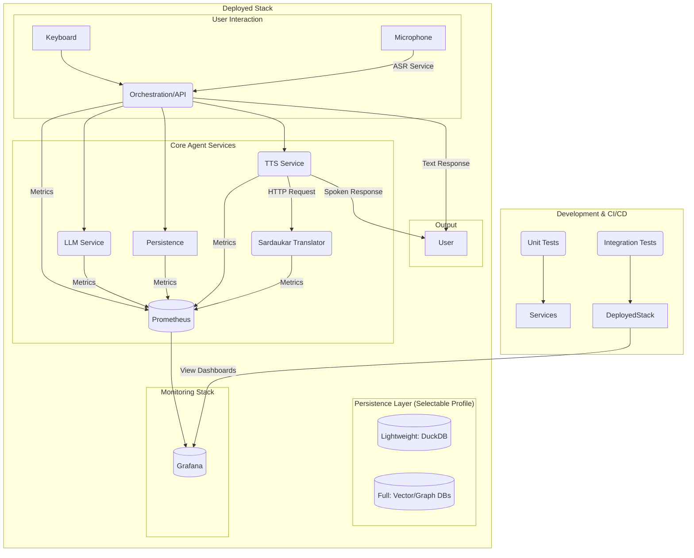

# Project Build & Deployment Plan (v3)

## 1. Guiding Principles

*   **Unified Architecture:** All services will be managed as a single, cohesive system.
*   **Environment Parity:** The local development environment will mirror the production environment as closely as possible to minimize deployment surprises.
*   **Automation:** The build, test, and deployment processes will be automated to ensure consistency and reduce manual effort.
*   **Flexible Persistence:** The system will support multiple database backends (embedded DuckDB and dedicated services) to suit different deployment targets.
*   **Observable & Testable:** The system will be instrumented for performance monitoring and will include a comprehensive, automated testing suite.
*   **Turnkey Deployment:** The solution will be designed for simple, one-command startup for all configurations.

## 2. Proposed Architecture with Monitoring

The architecture includes core services, selectable persistence layers, and a dedicated monitoring stack.

*   **Core Services:** API Gateway/Orchestrator, ASR, LLM, TTS, and the Sardaukar Translator.
*   **Persistence Profiles:**
    *   `lightweight`: Uses an embedded DuckDB instance for zero-dependency persistence.
    *   `full`: Uses dedicated ChromaDB and Neo4j containers for scalable deployments.
*   **Monitoring Stack:**
    *   **Prometheus:** A time-series database for collecting metrics from all services.
    *   **Grafana:** A visualization tool for creating dashboards to display the collected metrics.

## 3. Detailed Implementation Plan

### Step 1: Docker Compose Setup

The Docker Compose files will be structured to support profiles.

*   **`docker-compose.yml`:** Defines core services for the `lightweight` profile.
*   **`docker-compose.full.yml`:** Adds the `vector_db` and `graph_db` services.
*   **`docker-compose.monitoring.yml`:** Adds `prometheus` and `grafana` services.
*   **Execution:** Profiles will be run by combining files (e.g., `docker-compose -f ... -f ... up`).

### Step 2: Data Abstraction Layer

A data access layer in the `api` service will allow switching between DuckDB and the dedicated databases based on an environment variable.

### Step 3: Containerization

Each service will have its own `Dockerfile` to define its build process and dependencies.

### Step 4: Testing Strategy

A multi-layered testing strategy will be implemented.

*   **Unit Testing:**
    *   **Framework:** `pytest`.
    *   **Location:** `tests/` directory within each service.
    *   **Execution:** A `make test-unit` command will run tests without requiring Docker.
*   **Integration Testing:**
    *   **Framework:** `pytest` with HTTP libraries.
    *   **Location:** A top-level `integration_tests/` directory.
    *   **Execution:** A `make test-integration` command will use Docker Compose to spin up the full stack and test inter-service communication.

### Step 5: Performance Monitoring & Benchmarking

Services will be instrumented to collect and visualize performance data.

*   **Metrics Instrumentation:** Each service will expose a `/metrics` endpoint for Prometheus using the `prometheus-client` library.
*   **Grafana Dashboards:** A pre-configured Grafana dashboard will be created to visualize KPIs, including a side-by-side comparison of the `lightweight` and `full` profiles.
*   **Benchmarking:** A `benchmark/` directory will contain load testing scripts, runnable via `make benchmark`.

### Step 6: Cloud & Turnkey Deployment Strategy

A `Makefile` will serve as the central entry point for all automated tasks.

*   **`Makefile` Commands:**
    *   `make build`: Builds all Docker images.
    *   `make up-light` / `make up-full`: Starts local environments.
    *   `make test-unit` / `make test-integration`: Runs test suites.
    *   `make benchmark`: Runs performance tests.
    *   `make push`: Pushes images to a container registry.
    *   `make deploy-cloud`: Deploys the application to the cloud.

### Step 7: `sardaukar-translator` Integration

The `tts` service will be updated to conditionally call the `sardaukar-translator` API based on a runtime setting before synthesizing speech.