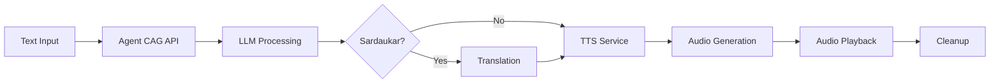

# Agent CAG Speech Tools

Command-line tools for generating speech from text using the [Agent CAG](https://github.com/prettygoodapps/agent-cag) system with optional Sardaukar translation.

## Overview

This repository contains two convenient command-line tools that interface with the Agent CAG AI system to:
- Generate AI responses from text input
- Convert responses to speech using text-to-speech
- Optionally translate responses to the fictional Sardaukar language
- Automatically play generated audio

## Tools

### 🐚 Shell Script: `agent_speak.sh`
A lightweight bash script for quick speech generation.

### 🐍 Python Script: `agent_speak.py`
An advanced Python tool with comprehensive features and options.

## Quick Start

1. **Prerequisites**:
   ```bash
   # Install sox for audio playback
   sudo apt install sox
   
   # For Python tool, install requests
   pip3 install requests
   ```

2. **Start Agent CAG services** (from the main [Agent CAG](https://github.com/prettygoodapps/agent-cag) directory):
   ```bash
   sudo docker-compose -f docker-compose.yml -f docker-compose.demo.yml up -d
   ```

3. **Make shell script executable**:
   ```bash
   chmod +x agent_speak.sh
   ```

4. **Basic usage**:
   ```bash
   # Shell script
   ./agent_speak.sh "Hello, how are you today?"
   
   # Python script
   python3 agent_speak.py "Hello, how are you today?"
   ```

5. **With Sardaukar translation**:
   ```bash
   # Shell script
   ./agent_speak.sh "Welcome to Agent CAG" --sardaukar
   
   # Python script
   python3 agent_speak.py "Welcome to Agent CAG" --sardaukar
   ```

## Features

| Feature | Shell Script | Python Script |
|---------|-------------|---------------|
| Basic speech generation | ✅ | ✅ |
| Sardaukar translation | ✅ | ✅ |
| Automatic audio playback | ✅ | ✅ |
| Service health checking | ✅ | ✅ |
| Error handling | ✅ | ✅ |
| Custom user ID | ❌ | ✅ |
| JSON-only output | ❌ | ✅ |
| Configurable service URLs | ❌ | ✅ |
| Advanced CLI options | ❌ | ✅ |

## Examples

### Basic Examples
```bash
# Simple speech generation
./agent_speak.sh "What is artificial intelligence?"
python3 agent_speak.py "What is artificial intelligence?"

# With Sardaukar translation
./agent_speak.sh "Hello world" --sardaukar
python3 agent_speak.py "Hello world" --sardaukar
```

### Advanced Python Examples
```bash
# Custom user ID
python3 agent_speak.py "Hello" --user-id my-user-123

# JSON output only (no audio)
python3 agent_speak.py "Hello" --json

# Custom service URLs
python3 agent_speak.py "Hello" --api-url http://localhost:8000 --tts-url http://localhost:8003
```

## How It Works



1. **Input**: User provides text to be processed
2. **API Call**: Tool sends request to Agent CAG API
3. **LLM Processing**: AI generates intelligent response
4. **Translation** (optional): Response translated to Sardaukar
5. **Speech Synthesis**: Text converted to speech using TTS service
6. **Playback**: Audio automatically downloaded and played
7. **Cleanup**: Temporary files removed

## Service Dependencies

The tools require these Agent CAG services to be running:

- **Agent CAG API** (port 8000): Main orchestration service
- **TTS Service** (port 8003): Text-to-speech conversion
- **Sardaukar Translator** (port 8004): Language translation (when using --sardaukar)

## Installation as Standalone Repository

To use these tools independently:

1. **Clone or download** this directory from the [Agent CAG repository](https://github.com/prettygoodapps/agent-cag/tree/main/agent-cag-speech-tools)
2. **Install dependencies**:
   ```bash
   sudo apt install sox curl
   pip3 install requests
   ```
3. **Make executable**:
   ```bash
   chmod +x agent_speak.sh
   ```
4. **Configure service URLs** if Agent CAG is running elsewhere:
   ```bash
   # Edit the scripts to change default URLs
   # Shell script: Edit API_URL and TTS_URL variables
   # Python script: Use --api-url and --tts-url options
   ```

## Troubleshooting

### Services Not Running
```bash
# Check if Agent CAG services are running
curl -f http://localhost:8000/health

# Start services (from Agent CAG directory)
git clone https://github.com/prettygoodapps/agent-cag.git
cd agent-cag
sudo docker-compose -f docker-compose.yml -f docker-compose.demo.yml up -d
```

### Audio Issues
```bash
# Install sox if missing
sudo apt install sox

# Test audio system
speaker-test -t sine -f 1000 -l 1
```

### Python Dependencies
```bash
# Install requests library
pip3 install requests

# Or use system package manager
sudo apt install python3-requests
```

## Contributing

This is a companion tool for the [Agent CAG system](https://github.com/prettygoodapps/agent-cag). For issues or contributions:

1. Check that Agent CAG services are running properly
2. Test with both tools to isolate issues
3. Include error messages and system information in reports
4. Submit issues to the main [Agent CAG repository](https://github.com/prettygoodapps/agent-cag/issues)

## License

This project follows the same license as the main [Agent CAG system](https://github.com/prettygoodapps/agent-cag).

## Related Projects

- **[Agent CAG](https://github.com/prettygoodapps/agent-cag)**: Main AI agent system with Context-Aware Graph capabilities
- **Sardaukar Translator**: Fictional language translator service (part of Agent CAG)
- **Agent CAG TTS**: Text-to-speech service with translation integration (part of Agent CAG)